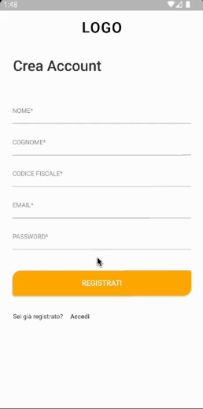
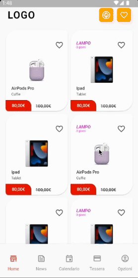
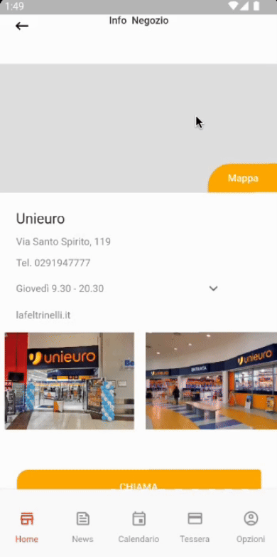
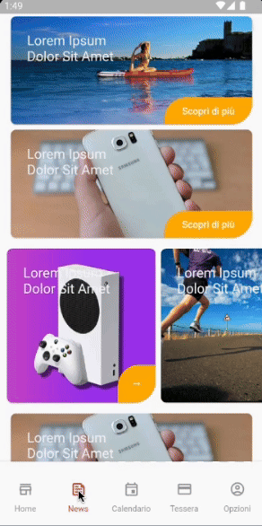
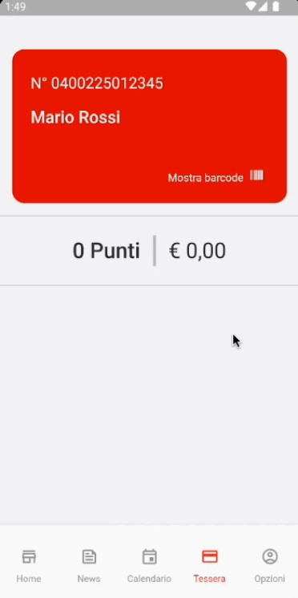
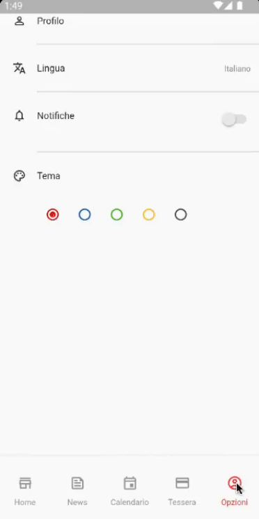

# Customer Loyalty Flutter App

Customer loyalty app for a general electronics company. 
Developed in 2022, it is not updated with the latest versions of Flutter, Dart and Java.
Designed and tested on Android phone.

The project is in the [poc](https://github.com/marcoseverini/customer-loyalty-app/tree/main/poc) folder.

## Requirements
- Flutter 3.0.5
- Dart 2.17.6
- JDK 17

  
  
  
  
  
  

The app is not complete, for example the calendar section is still missing, feel free to implement it.
